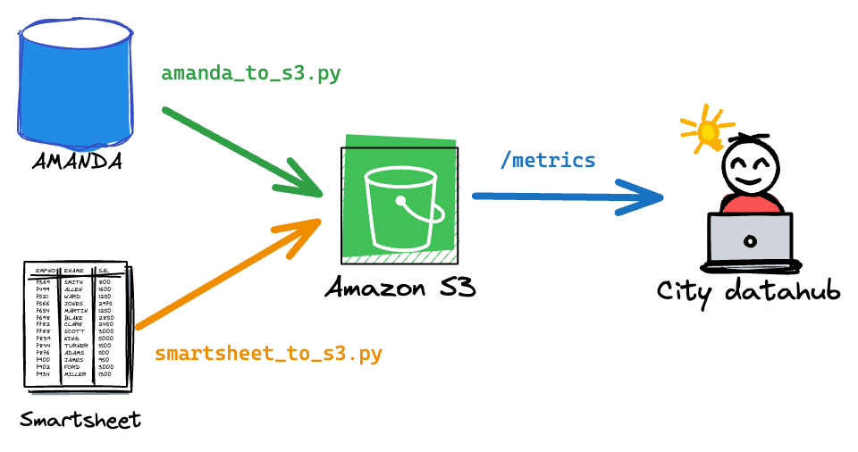

# Right of Way (ROW) Reporting

Scripts that pull data from AMANDA and other data sources to enable the city to report on the work by the [Transportation & Public Works Department's Right of Way Management Division.](https://www.austintexas.gov/department/right-way-row-management)

## AMANDA

AMANDA is the backend system that underlies the [Austin Build + Connect](https://abc.austintexas.gov/index) portal which the ROW division uses to manage permitting. 

`amanda_to_s3.py` is a script that allows us to run queries on the AMANDA read replica oracle DB and store the result as a .csv file in an AWS S3 bucket. To run this script, select one of the predefined queries in `queries.py` and provide the key as a parameter to the script.

`$ python amanda/amanda_to_s3.py --query applications_received`

### Queries

- `applications_received`: Gets the count of the number of right of way (ROW) permits received by day and folder type.
- `active_permits`: Gets the current number of active ROW permits by type.
- `issued_permits`: Gets the count of the number ROW permits issued by day and folder type.
- `review_time`: Gets a list of dates of different processes of a RW permit's review timeline.
- `ex_permits_issued`: Gets the list of EX permits and their indate and issuedate
- `license_agreements_timeline`: Gets a list of license reviews and a series of dates of review completion dates. 
- `lde_site_plan_revisions`: Gets a list of land development engineering reviews and key dates for reviews and their due dates.
- `row_inspector_permit_list`: Returns all active permits assigned to the Right of Way division.
- `row_inspector_segment_list`: Returns roadway segment IDs associated with active permits

## Smartsheet

[Smartsheet](https://www.smartsheet.com/) is an additional tool the ROW team uses to manage some types of permits. `smartsheet_to_s3.py` downloads all of the data from the predefined list of sheets in `sheets.py` and stores the data as a .csv file in an AWS S3 bucket. There are no parameters for this script.

`$ python smartsheet/smartsheet_to_s3.py`

## Metrics

This sub directory stores the scripts that processes the data from AMANDA and/or smartsheet for reporting purposes. 

`active_permits_logging.py` posts the current number of active permits to the [city's data hub](https://datahub.austintexas.gov/login). 

`python metrics/active_permits_logging.py`

`row_data_summary.py` totals up the count of the various types of permits that were requested and issued to [city's data hub](https://datahub.austintexas.gov/login). 

`python metrics/row_data_summary.py`

`inspector_prioritization.py` "scores" permits based on several metrics to rank permits based on a prioritization for ROW inspectors.

`python metrics/inspector_prioritization.py`

## Docker

This repo can be used with a docker container. You can either build it yourself with:

`$ docker build . -t dts-right-of-way-reporting:production`

or pull from our dockerhub account:

`$ docker pull atddocker/dts-right-of-way-reporting:production`

Then, provide the environment variables described in env_template to the docker image:

`$ docker run -it --env-file env_file dts-right-of-way-reporting:production /bin/bash` 

Then, provide the command you would like to run.
